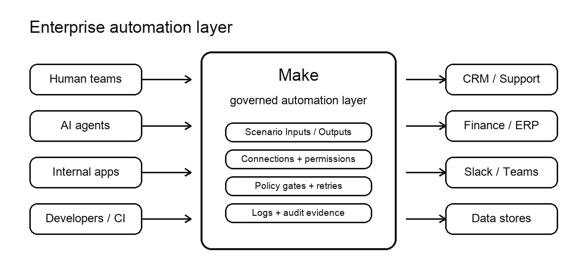
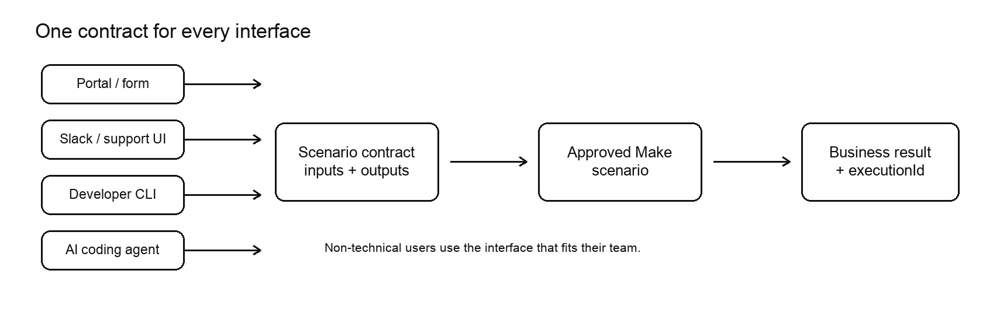
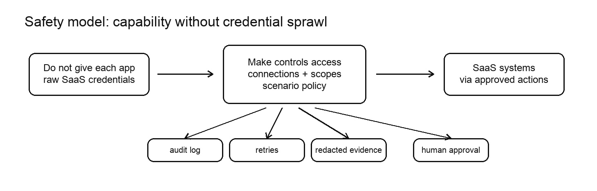
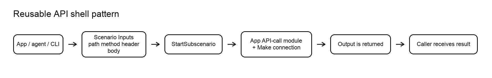

# Make Headless Automation

Use Make headlessly.

Connect AI agents, vibe coders, internal apps, and humans to the automations your team already trusts.

Make becomes the enterprise API layer for your company: one governed scenario contract, many interfaces.



## What This Shows

- Build scenarios programmatically.
- Expose Scenario Inputs and Scenario Outputs as the contract.
- Call approved automations from CLI, API, CI, AI agents, or web apps.
- Review, debug, and manage the same automations visually in Make.
- Keep connections, credentials, policy, logs, retries, and evidence inside Make.



## Why

AI-generated apps and agent workflows should not own every SaaS credential or reimplement every vendor API.

They should send business intent to Make:

```bash
make-cli scenarios interface <scenario-id>
make-cli scenarios run <scenario-id> --data='{"businessInput":"value"}' --responsive
```

Make runs the approved automation and returns structured output:

```json
{
  "executionId": "exec_...",
  "approvalStatus": "pending-approval",
  "crmUpdateId": "CRM-UPDATE-001",
  "nextStep": "Notify the approver"
}
```

Humans can use a portal, form, Slack app, support console, or internal UI. Developers and AI agents can use CLI or API. Everyone hits the same governed Make scenario.



## API Shell Pattern

Use an API shell when an app or agent needs controlled access to SaaS data.

The shell wraps one approved Make connection and one app-specific API-call module behind Scenario Inputs and Scenario Outputs. The caller gets normalized data back. The caller does not get raw OAuth secrets.



## Business Demos

| Workflow | What triggers it | What Make returns |
| --- | --- | --- |
| `inbound-lead-qualification` | Signup, website form, or partner lead | `crmLeadId`, `score`, `owner`, `nextStep`, `executionId` |
| `customer-escalation-pack` | Critical ticket or SLA risk | `escalationId`, `owner`, `slaDeadline`, `channelUrl`, `executionId` |
| `deal-desk-approval` | Quote or discount request | `approvalStatus`, `approver`, `crmUpdateId`, `policyFlags`, `executionId` |
| `invoice-exception-resolution` | Invoice and PO mismatch | `resolutionStatus`, `approver`, `taskId`, `auditRecordId`, `executionId` |

Each workflow has a fixture input in `examples/payloads/` and a sanitized expected output in `examples/outputs/`.

## Quick Start

```bash
npm test
npm run list
node bin/headless-make.mjs demo deal-desk-approval
```

Fixture mode writes redacted evidence to `out/` and does not call Make.

## Live Setup

Copy `.env.example` to `.env` and set:

```bash
MAKE_API_KEY=...
MAKE_ZONE=us1.make.com
MAKE_DEAL_DESK_SCENARIO_ID=...
```

Install or expose Make CLI:

```bash
npm install -g @makehq/cli
make-cli whoami
```

If `make-cli` is not installed, this repo falls back to `npx --yes @makehq/cli` when `npx` is available.

## Commands

```bash
node bin/headless-make.mjs doctor
node bin/headless-make.mjs list-workflows
node bin/headless-make.mjs demo deal-desk-approval
node bin/headless-make.mjs demo deal-desk-approval --live
node bin/headless-make.mjs run 925 \
  --workflow deal-desk-approval \
  --data-file examples/payloads/deal-desk-approval.json
```

## Live Flow

```bash
# 1. Discover the scenario contract
make-cli scenarios interface "$MAKE_DEAL_DESK_SCENARIO_ID"

# 2. Run the approved automation
node bin/headless-make.mjs demo deal-desk-approval --live

# 3. Keep the returned evidence
cat out/deal-desk-approval.evidence.json
```

## Safety

- This repo does not create, update, activate, or delete scenarios by default.
- Fixture mode is the default for `demo`.
- Live writes only happen inside pre-approved Make scenarios.
- Generated evidence is written to `out/`, which is gitignored.
- Evidence is redacted for API keys, tokens, authorization headers, emails, UUIDs, and Make zone URLs.
- End users do not need the terminal; the CLI is for developers, AI coding agents, scripts, and CI/CD jobs.

## More

- Talk track: [docs/talk.md](docs/talk.md)
- Editable diagrams: [docs/diagrams](docs/diagrams)
- Direct API fallback:

```bash
curl -X POST "https://$MAKE_ZONE/api/v2/scenarios/$SCENARIO_ID/run" \
  -H "Authorization: Token $MAKE_API_KEY" \
  -H "Content-Type: application/json" \
  -d '{"data":{"key":"value"},"responsive":true}'
```
